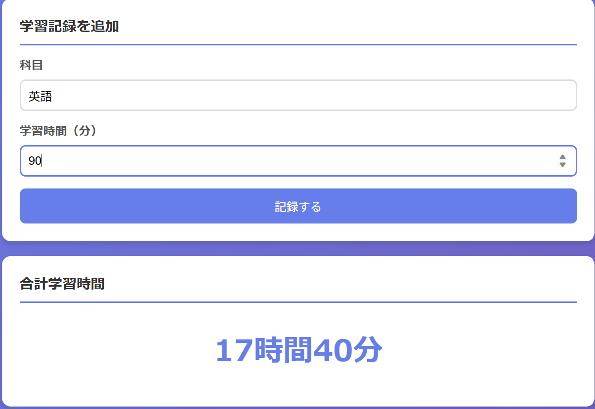
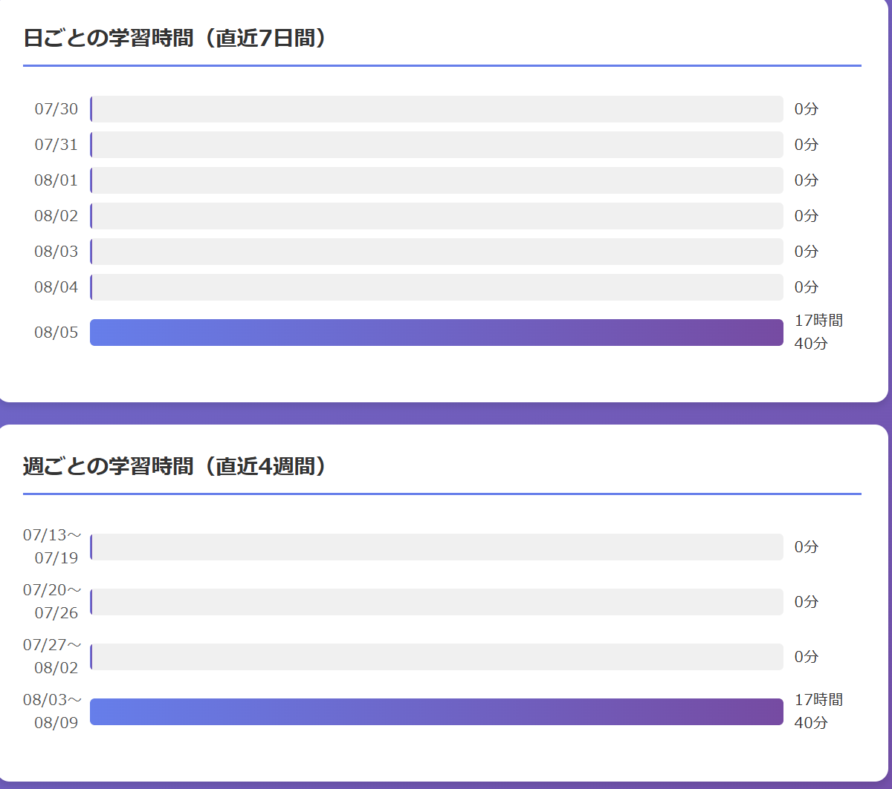

# 📚 学習記録アプリ

学習した科目と学習時間を記録し、合計学習時間や科目ごとの集計を日ごと・週ごとに可視化するWebアプリケーションです。

## システム概要

- **バックエンド**: Python (Flask) + SQLite
- **フロントエンド**: HTML / CSS / JavaScript
- **実行環境**: Dockerコンテナ（docker-compose）
- **データ永続化**: Dockerボリューム（`study-data`）にSQLiteデータベースを保存

## 主な機能

| 機能 | 説明 |
|------|------|
| 学習記録の追加 | 科目名と学習時間（分）を入力して記録 |
| 合計学習時間の表示 | 全記録の合計を「X時間Y分」形式で表示 |
| 科目ごとの集計 | 科目別の学習時間を多い順に表示 |
| 日ごとの集計 | 直近7日間の学習時間をバーチャートで表示 |
| 週ごとの集計 | 直近4週間（月曜始まり）の学習時間をバーチャートで表示 |

## 必要環境

- Docker
- Docker Compose

## 実行方法

### 1. リポジトリをクローン

```bash
git clone https://github.com/haru-fumi/ai-study-app.git
cd ai-study-app
```

### 2. Dockerコンテナを起動

```bash
docker compose up -d --build
```

### 3. ブラウザでアクセス

以下のURLをブラウザで開きます。

```
http://localhost:8080
```

### 4. コンテナの停止

```bash
docker compose down
```

## 使い方

1. **学習記録を追加**
   - 「科目」欄に学習した科目名を入力（例: 数学、英語、物理）
   - 「学習時間（分）」欄に学習時間を分単位で入力（例: 60）
   - 「記録する」ボタンをクリック

2. **集計結果の確認**
   - **合計学習時間**: 全記録の合計が表示されます
   - **科目ごとの学習時間**: 科目別の合計が学習時間の多い順に表示されます
   - **日ごとの学習時間**: 直近7日間の学習時間がバーチャートで表示されます
   - **週ごとの学習時間**: 直近4週間の学習時間がバーチャートで表示されます

## 動作画面





## プロジェクト構成

```
study-app/
├── docker-compose.yml   # Docker Compose設定（ポート8080→5000）
├── Dockerfile           # Python 3.12-slim ベースのイメージ定義
├── requirements.txt     # 依存パッケージ（Flask 3.0.3）
├── app.py               # バックエンドAPI（記録追加・集計）
├── templates/
│   └── index.html       # フロントエンド画面
└── static/
    ├── style.css        # スタイルシート
    └── script.js        # フロントエンド処理
```

## API仕様

### 学習記録の追加

```
POST /api/records
```

**リクエストボディ（JSON）**:
```json
{
  "subject": "数学",
  "minutes": 60
}
```

**レスポンス**:
```json
{
  "message": "記録を追加しました"
}
```

### 集計データの取得

```
GET /api/summary
```

**レスポンス**:
```json
{
  "total_minutes": 60,
  "subject_totals": {
    "数学": 60
  },
  "daily": [
    {
      "date": "2026-08-05",
      "label": "08/05",
      "minutes": 60
    }
  ],
  "weekly": [
    {
      "start": "08/03",
      "end": "08/09",
      "minutes": 60
    }
  ]
}
```

## ライセンス

このプロジェクトは学習目的で作成されたものです。